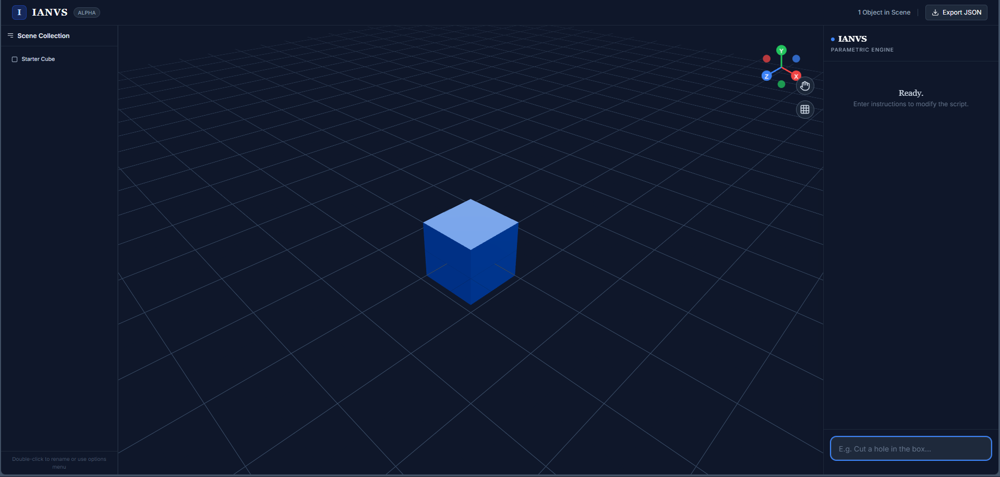
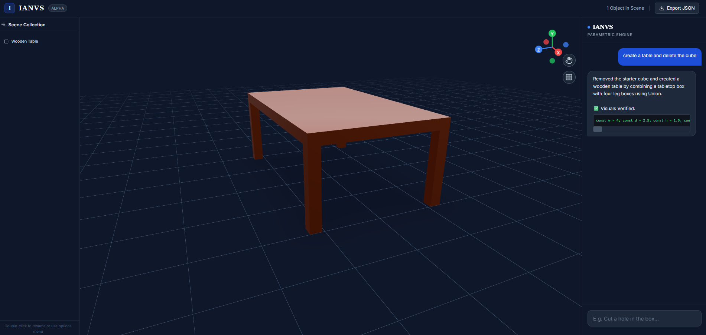
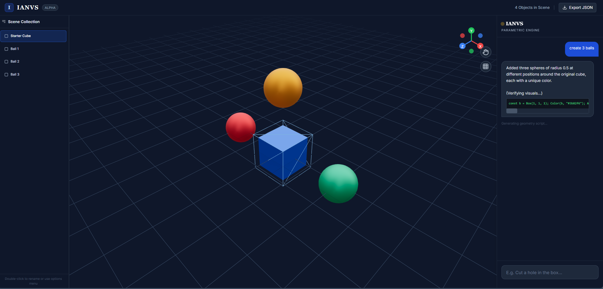
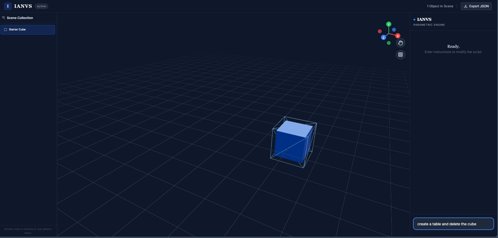

# Janus

**Janus** (stylized as **IANVS**) is an AI-powered 3D CAD platform built with React, Three.js, and Google Gemini API. It bridges the gap between natural language intention and geometric execution.

## Features

- **AI-Driven Architect**: Type commands like "Create a red chair" or "Split the cube in half".
- **3D Visualization**: Real-time rendering using `react-three-fiber`.
- **Export**: Download your scene as JSON to save your work.
- **Context Aware**: Reference objects using `@Name` (e.g., "Rotate @Table 90 degrees").
- **Visual Verification**: Self-correcting AI that views the scene from multiple angles (8-point orbital view) to ensure geometry accuracy.

## Gallery

### Initial State

### Natural Language Generation

### Complex Composition

### Object Manipulation

## Project Structure

The project follows a strict separation of concerns:

### `frontend/`
Contains all React UI components and visualization logic.
- `components/Viewer3D.tsx`: The main 3D canvas rendering the scene.
- `components/ChatInterface.tsx`: The chat sidebar for communicating with the AI.
- `components/Header.tsx`: Navigation and global actions.

### `backend/`
Contains the business logic and API integrations.
- `engine/SceneManager.ts`: A class-based module responsible for maintaining the state of the 3D world and applying transformations.
- `services/geminiService.ts`: Handles communication with the Google Gemini API, including prompt engineering and JSON schema validation.

### Root Files
- `App.tsx`: The main controller that glues the Frontend components to the Backend services.
- `types.ts`: Shared TypeScript interfaces for type safety across the stack.

## Getting Started

1. Ensure `process.env.API_KEY` is set with a valid Google Gemini API Key.
2. The application uses CDN-based Tailwind for styling and Google Fonts (Cinzel for branding).
3. No build step required if using a modern ESM-compatible environment.

## Usage

1. **Select**: Click an object in the 3D view to select it.
2. **Rotate/Pan**: Left click to rotate, right click to pan.
3. **AI Command**: Type in the right-hand panel.
   - *Example*: "Add a blue sphere on top of the cube."
   - *Example*: "Make the cube taller."
   - *Example*: "Delete the sphere."

## Dependencies

- React 18
- Tailwind CSS
- Three.js / React Three Fiber / Drei
- @google/genai SDK
